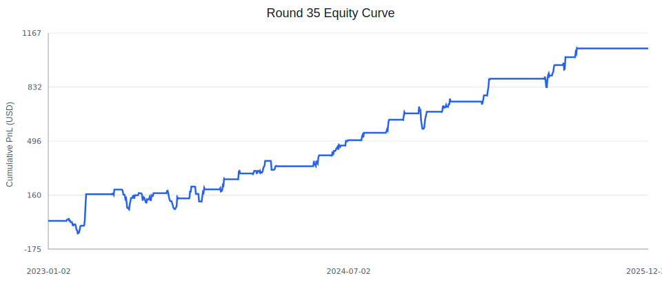
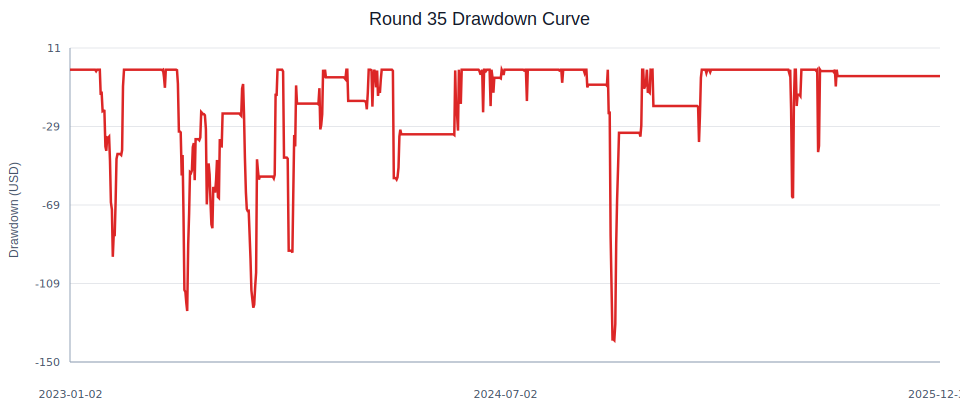
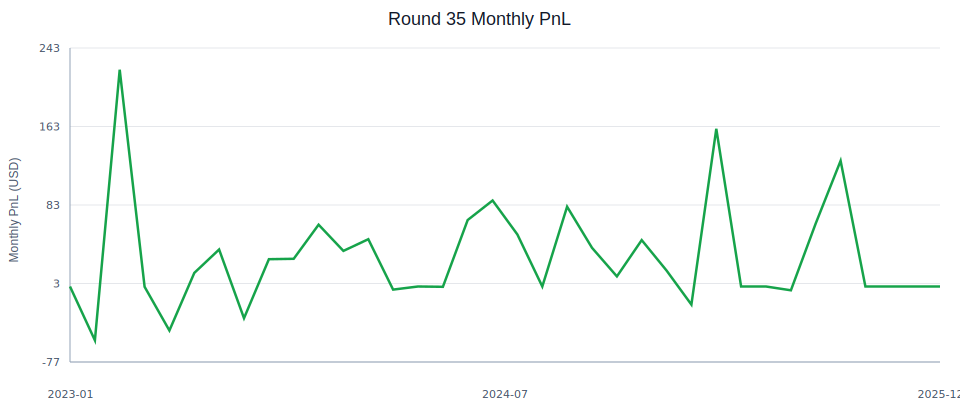

# FITE7415 ALGOGENE Trading Strategy Report

## Group Info

|   | Student Name | UID |
| - | ------------ | --- |
| 1. | Zhang Haotian | u3665820 |
| 2. | [Fill in] | [Fill in] |
| 3. | [Fill in] | [Fill in] |

## ALGOGENE System Info

| Field | Value |
| --- | --- |
| User ID | [Fill in ALGOGENE user ID] |
| Backtest ID | task_id `1777127674477152`; runtime_id `20260425_143434_477152` |
| Strategy Name | `XAUUSD-ZEntry-Grid-R35` |
| Strategy Script | `Program/XAUUSD-ZEntry-Grid/code/xauusd_round35_stop1_10_v1.py` |
| Instrument | `XAUUSD` |
| Dataset | `1440` daily bars |
| Main Backtest Window | `2023-01` to `2025-12` |
| Initial Capital | `USD 10,000` |
| Leverage | `1x` |
| Short Selling | Disabled |

The full strategy script is stored in the repository. The core parameters of the final version are:

```python
self.symbol = "XAUUSD"
self.sma_period = 20
self.std_period = 20
self.z_entry = -0.75
self.atr_period = 14
self.stop_atr_multiple = 1.10
self.take_profit_atr_multiple = 4.0
self.max_hold_days = 5
self.risk_per_trade = 0.005
```

## Executive Summary

This project develops a daily mean-reversion trading strategy for XAUUSD on the ALGOGENE platform. The final strategy, `XAUUSD-ZEntry-Grid-R35`, trades gold only from the long side. It enters when the current gold price is moderately oversold relative to its 20-day moving average, then manages downside and exit timing through ATR-based stop loss, ATR-based take profit, and a maximum holding period.

The market hypothesis is that XAUUSD, while strongly affected by macroeconomic events, often shows short-term mean-reversion behavior after moderate daily oversold moves. Instead of forecasting long-term gold direction, the strategy attempts to capture short-term recovery after price dislocation. The trading signal uses only daily OHLC price data from ALGOGENE; no news, economic calendar, weather, or external datasets are used. This keeps the strategy transparent, reproducible, and suitable for a course project where interpretability matters.

The final full-sample backtest from January 2023 to December 2025 produced:

| Version | TradeCnt | TotalPnL | Sharpe | Sortino | MaxDD | Profit factor |
| --- | --- | --- | --- | --- | --- | --- |
| Round 35 final | 112 | +1071.3050 | 1.7139 | 3.2289 | 0.0129 | 2.6675 |

Compared with the early Round 23 baseline, Sharpe improved from `0.7956` to `1.7139`, while maximum drawdown fell from `0.02653` to `0.01293`. The result is not selected purely by highest PnL; the final version is chosen because it improves return, Sharpe, drawdown, weak-window performance, and transaction-cost robustness at the same time.

## Implementation Details

### Strategy Logic

The strategy is a long-only daily XAUUSD mean-reversion system. On each new daily market data event, the strategy requests historical daily bars from ALGOGENE using:

```python
getHistoricalBar({"instrument": "XAUUSD"}, count, "D", bar_day)
```

It then computes:

- `SMA(20)`: short-term fair-value anchor.
- `STD(20)`: volatility of recent closing prices.
- `ATR(14)`: market volatility used for stop loss and take profit.
- `zscore = (close - SMA(20)) / STD(20)`.

A long entry is triggered when:

```text
zscore <= -0.75
```

This means the price is at least 0.75 standard deviations below its 20-day average. The threshold is deliberately moderate: earlier testing showed that overly strict thresholds missed profitable mean-reversion opportunities, while overly loose thresholds admitted too much noise.

Once a trade is opened, the exit logic is:

```text
Stop loss   = entry price - 1.10 * ATR(14)
Take profit = entry price + 4.00 * ATR(14)
Max holding = 5 calendar days
```

The strategy does not pyramid positions. It also waits until the maximum holding period has passed before considering a new entry, which prevents excessive clustering of trades during the same price event.

### Position Sizing

Position size is determined by fixed fractional risk:

```text
risk amount per trade = initial capital * 0.5%
                      = 10,000 * 0.005
                      = USD 50
```

The code estimates risk per lot from the distance between entry and stop loss, then rounds the volume down to the nearest `0.01` lot. It also caps the position by available capital, so the strategy does not rely on leverage expansion.

### Optimization Methodology

The optimization process was intentionally structured as a sequence of single-factor tests. Each round changed one main parameter family so that the performance change could be explained:

| Version | Key Change | TotalPnL | Sharpe | MaxDD |
| --- | --- | ---: | ---: | ---: |
| Round 23 | Initial XAUUSD baseline | +696.9780 | 0.7956 | 0.02653 |
| Round 26 | `z_entry=-1.0` branch | +601.6870 | 1.1869 | 0.01281 |
| Round 30 | `stop_atr_multiple=1.15` | +791.9070 | 1.3797 | 0.01627 |
| Round 33 | `z_entry=-0.75` | +1007.5500 | 1.6275 | 0.01608 |
| Round 35 | `stop_atr_multiple=1.10` | +1071.3050 | 1.7139 | 0.01293 |

Round 31 tested alternative SMA/std windows and found that 20 days remained the best observation window. Round 34 tested take-profit levels and found that TP values at or above 4.0x ATR produced the same result, so the simpler 4.0x ATR setting was retained. Round 35 then refined the stop-loss multiple and selected 1.10x ATR because it delivered the best risk-adjusted performance.

## Risk Management

The main risk factors are:

1. **Trend continuation risk.** A mean-reversion long can lose money if gold continues falling after an oversold signal.
2. **Macro shock risk.** XAUUSD is sensitive to interest rates, USD strength, inflation expectations, central bank policy, and geopolitical risk.
3. **Gap and execution risk.** ATR stop loss may not be filled exactly at the intended level during sharp overnight moves.
4. **Parameter overfitting risk.** Several rounds of parameter tuning were performed on the 2023-2025 backtest window.
5. **Low trade frequency risk.** The strategy trades only about 2.63 times per month, so short validation windows may contain limited observations.

Risk is managed through multiple layers:

- ATR-based stop loss adapts to the current volatility of gold.
- Each trade risks only 0.5% of initial capital before rounding.
- No leverage expansion is used.
- Short selling is disabled to keep implementation risk lower.
- Maximum holding period is capped at 5 days, reducing exposure to stale signals.
- The final version is checked under a weak recent window and transaction-cost stress.

The final maximum drawdown is `0.01293`, or about 1.29% of capital. This is well below the internal 5% risk threshold used during the optimization process.

## Capital Management

The strategy uses `USD 10,000` as the reference capital. It is intentionally designed to avoid high leverage and to size positions from stop-loss distance rather than from a fixed number of lots.

The capital-management assumptions are:

- Initial capital: `USD 10,000`.
- Base currency: `USD`.
- Leverage: `1x`.
- Per-trade risk target: `0.5%` of initial capital.
- Minimum volume: `0.01`.
- Volume step: `0.01`.

The practical minimum capital depends on broker contract specification, margin rules, and minimum tradable lot. With XAUUSD trading around a few thousand USD per ounce and the strategy using a `contract_size=100`, very small accounts would suffer from volume rounding and could not express the intended 0.5% risk accurately. A `USD 10,000` account is therefore a reasonable minimum for this implementation.

The strategy is moderately scalable for small to medium accounts because XAUUSD is a liquid instrument and the strategy trades daily bars rather than high-frequency signals. However, it is not infinitely scalable. If capital becomes very large, market impact, slippage around stop levels, and broker margin requirements may reduce performance. In real trading, capital should be increased gradually and monitored through realized slippage and fill quality.

## Backtest Performance

### Full-Sample Result

The main backtest window is January 2023 to December 2025 on ALGOGENE daily XAUUSD data.





Key full-sample statistics:

| Metric | Value |
| --- | ---: |
| Trade count | 112 |
| Total PnL | +1071.3050 |
| Annual Sharpe | 1.7139 |
| Annual Sortino | 3.2289 |
| Max drawdown | 0.01293 |
| Profit factor | 2.6675 |
| Average holding days | 4.6964 |
| Trades per month | 2.6297 |
| Win rate | 0.4962 |

The strategy does not win on every trade, but its average winning periods are large enough relative to losses to produce a profit factor above 2.6. The win rate is around 50%, which is acceptable for a mean-reversion strategy with asymmetric ATR exits.

### Segment Robustness

The final parameters were selected using the 2023-2025 window, so the following table should be interpreted as a segment robustness check rather than a fully independent out-of-sample test.

| Segment | TradeCnt | TotalPnL | Sharpe | MaxDD |
| --- | --- | --- | --- | --- |
| 2023 | 56 | +294.7100 | 1.2433 | 0.0121 |
| 2024 | 41 | +413.4850 | 2.1100 | 0.0133 |
| 2025 | 14 | +329.9300 | 2.1762 | 0.0065 |
| 2025H1 | 7 | +89.2300 | 1.5918 | 0.0065 |
| 2025H2 | 8 | +183.4650 | 2.1019 | 0.0042 |

The result is positive in every year. This is important because it shows that the final PnL is not driven by only one isolated period. The number of trades in 2025 is smaller, so the 2025 Sharpe should not be overinterpreted, but the period still provides supportive evidence that the strategy did not collapse in the most recent sample.

### Monthly PnL Breakdown



The full monthly PnL table is stored in `Program/XAUUSD-ZEntry-Grid/final_report/monthly_pnl.md`. Several months have zero PnL because the strategy is selective and does not trade every month. This low-frequency behavior is intentional: the strategy only enters when the z-score condition is met.

### Transaction-Cost Stress

| Setting | TradeCnt | TotalPnL | Sharpe | MaxDD |
| --- | --- | --- | --- | --- |
| Base | 112 | +1071.3050 | 1.7139 | 0.0129 |
| TradeCost=1 | 112 | +1015.3050 | 1.6207 | 0.0132 |
| TradeCost=2 | 112 | +1015.3050 | 1.6207 | 0.0132 |
| TradeCost=3 | 112 | +1015.3050 | 1.6207 | 0.0132 |
| TradeCost=5 | 112 | +1015.3050 | 1.6207 | 0.0132 |

The `TradeCost` field was submitted with values 1, 2, 3, and 5. ALGOGENE returned identical results for the non-zero cost settings, which suggests that this account or API path may treat the field as a fixed enabled-cost setting rather than as a linear per-unit cost. The important point is that the strategy remains profitable and keeps Sharpe above 1.6 after transaction cost is enabled.

### Optimization Criterion

The primary model-selection metric is Annual Sharpe, because the project aims to improve risk-adjusted return rather than simply maximize PnL. A candidate strategy was preferred only if it improved Sharpe while keeping drawdown controlled and maintaining enough trades for statistical credibility. PnL, max drawdown, trade count, weak-window performance, and transaction-cost sensitivity were used as secondary filters.

## Expectations for Real Trading

The strategy is most favorable in markets where gold experiences short-term oversold moves followed by partial mean reversion. It is less favorable in strong one-way downtrends, large macro shocks, or fast repricing events where price continues falling after an oversold signal.

The strategy can be automated because all rules are deterministic and use only daily OHLC data. However, real trading would still require monitoring:

- Broker spread and slippage.
- Whether stop-loss and take-profit orders are filled at expected levels.
- Overnight gaps and weekend risk.
- Margin requirements for XAUUSD.
- Data-feed differences between ALGOGENE and a real broker.

The average trading frequency is low, about 2.63 trades per month in the full-sample backtest. This makes the strategy operationally simple and reduces trading-cost pressure, but it also means that performance should be evaluated over long periods rather than over a few weeks.

The ideal initial investment size for this implementation is around `USD 10,000` or higher. The strategy does not require leverage beyond the 1x setting used in the backtest. In real trading, a conservative deployment would start with paper trading or a small live account, then scale only after realized slippage, fill quality, and drawdown behavior are consistent with the backtest.

## Limitations and Further Work

The most important limitation is that all official ALGOGENE backtests are constrained by the current account permission to the range `2021-01` to `2025-12`. Although the history-price endpoint shows that XAUUSD data exists into 2026, the backtest engine rejected a 2026 test with the message that the account only allows StartDate and EndDate within `2021-01` to `2025-12`. Therefore, 2026 is not included as an official out-of-sample backtest in this report.

The next improvements would be:

1. Run a true 2026 out-of-sample backtest if account permissions are upgraded.
2. Repeat the final strategy on a second liquid instrument, such as EURUSD, to test cross-market transferability.
3. Compare ALGOGENE execution assumptions with a broker-specific spread and slippage model.
4. Continue monitoring performance through paper trading before using real capital.

## Appendix: Reproduction Command

From the project root:

```powershell
.\FITE7415\Scripts\python.exe scripts\algogene_backtest.py --expect-round35
```

The default strategy in the automation script is:

```text
Program/XAUUSD-ZEntry-Grid/code/xauusd_round35_stop1_10_v1.py
```

The automation script submits the backtest to ALGOGENE, polls task status, fetches `strategy_stats`, `strategy_logs`, and `strategy_pl`, then saves raw outputs under:

```text
Program/XAUUSD-ZEntry-Grid/backtests/<timestamp>/
```

Supporting research reports:

- `Program/XAUUSD-ZEntry-Grid/reports/28th-round.md`
- `Program/XAUUSD-ZEntry-Grid/reports/29th-round.md`
- `Program/XAUUSD-ZEntry-Grid/reports/30th-round.md`
- `Program/XAUUSD-ZEntry-Grid/reports/31st-round.md`
- `Program/XAUUSD-ZEntry-Grid/reports/32nd-round.md`
- `Program/XAUUSD-ZEntry-Grid/reports/33rd-round.md`
- `Program/XAUUSD-ZEntry-Grid/reports/34th-round.md`
- `Program/XAUUSD-ZEntry-Grid/reports/35th-round.md`
- `Program/XAUUSD-ZEntry-Grid/reports/B-mainline-optimization-closeout.md`

